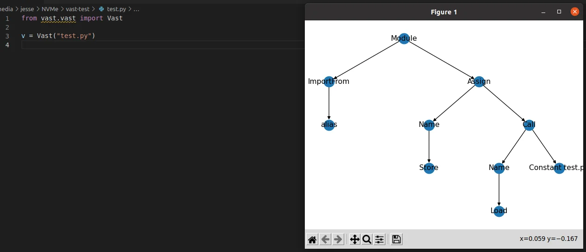
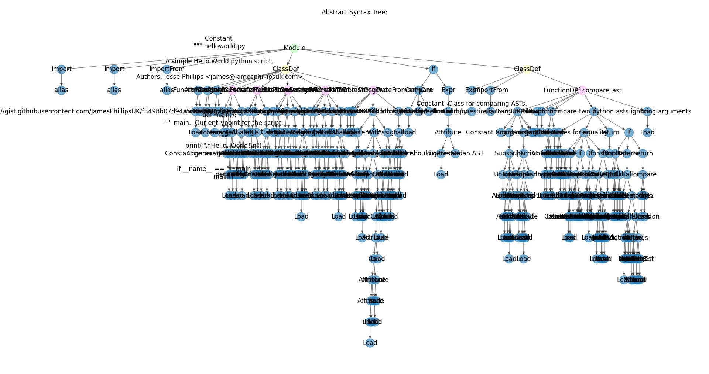
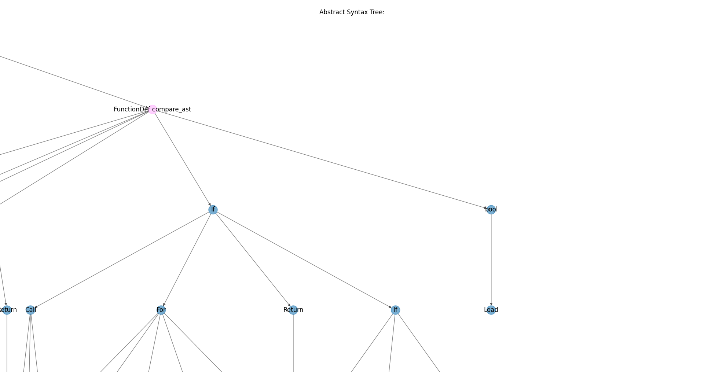

# VisAST

VisAST - Visualise Abstract Syntax Trees for Python.

VisAST generates ASTs for a given Python script and builds visualisations of them.

## Install

Install from PyPI [Here!](https://pypi.org/project/VisAST/)

`pip install visast`

## How to use

From a python script:

```python
from visast import generate, visualise

ast = generate.fromPath("./helloworld.py")
visualise.graph(ast)
# or
pyString = "print(\"Hello, World!\")"
ast = generate.fromromString(pyString)
visualise.graph(ast)
# or
pyURL = "https://example.com/helloworld.py"
ast = generate.fromURL(pyURL)
visualise.graph(ast)
```

or, from the command line, `python -m visast helloworld.py`

## Like what you see?  Buy me a snack

If you want to see more of what I do, you can visit [my blog](https://jamesphillipsuk.com "Go there now").

If you want to donate to my development work by buying me a snack, I use [PayPal.Me](https://paypal.me/JamesPhillipsUK "My PayPal.Me").

## Gallery

Here's what it looks like:



Here's a more complicated example:



And to zoom in on that:



## Contributing

Please make sure the tests pass, by running `python -m unittest` (or by running `tests/test_visast.py`) and making sure you get an `OK` at the end.

Additionally, the project should typecheck under `pyright` and `mypy --install-types --non-interactive && mypy --follow-untyped-imports .`

